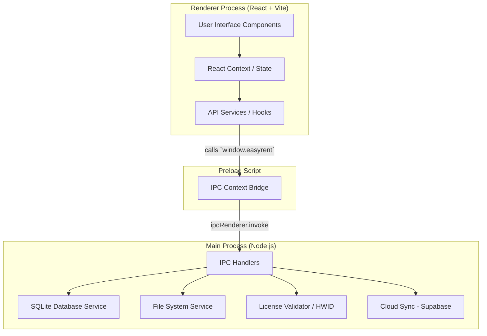

# Arquitectura del Sistema EasyRent

## 1. Patrón Arquitectónico

EasyRent está construido utilizando el framework **Electron.js**, el cual emplea una arquitectura multiproceso estructurada de la siguiente manera:

1.  **Proceso Principal (Main Process):** Desarrollado en Node.js, es el encargado de interactuar con el sistema operativo. Administra el ciclo de vida de la aplicación, las ventanas (BrowserWindows), gestiona el acceso al sistema de archivos local y mantiene la única conexión concurrente a la base de datos SQLite.
2.  **Proceso de Renderizado (Renderer Process):** Representa la Interfaz de Usuario (UI) de la aplicación. Está construido como una Single Page Application (SPA) utilizando **React 18** y **Vite**. Este proceso no tiene, por defecto, acceso directo a las APIs de Node.js por políticas de seguridad (Context Isolation).
3.  **Puente de Comunicación (Preload Script):** Un script especial ( `preload.js`) que funciona como puente entre el Proceso de Renderizado y el Proceso Principal de manera segura. Expone funciones específicas en un objeto global (ej: `window.easyrent`) bajo un mecanismo conocido como **Inter-Process Communication (IPC)**.

## 2. Diagrama de Arquitectura de Alto Nivel



## 3. Componentes del Proceso Principal

-   `electron/main.js`: Punto de entrada de la aplicación. Inicializa la base de datos, carga las dependencias locales, define las rutas de almacenamiento (UserData), inicia el `SplashScreen` y posteriormente la ventana de React, y finalmente, adhiere todos los receptores (Handlers) IPC.
-   `electron/database.js`: Capa de persistencia (DAO / Repository). Utiliza `better-sqlite3` para crear esquemas, ejecutar migraciones dinámicas de tablas e insertar/actualizar/consultar datos.
-   `electron/hwid.js`: Módulo específico para leer identificadores unívocos del hardware del cliente mediante librerías como `node-machine-id`, base para el sistema de licencias.
-   `electron/license.js`: Implementa la lógica de evaluación, caducidad, y engrasamiento de licencias de escritorio e híbridas, interactuando eventualmente con bases de datos externas para validación.
-   `electron/cloudSync.js`: Utiliza el SDK de **Supabase** (`@supabase/supabase-js`) para respaldar las tablas de SQLite hacia la nube, logrando portabilidad de la información en escenarios híbridos de "Desktop to Web".

## 4. Estructura de Directorios

La organización del proyecto separa claramente los dos entornos principales y respeta pautas contemporáneas de desarrollo frontend:

```text
GestionInmuebles/
│
├── electron/                   # Código del Main Process
│   ├── main.js                 # Inicialización y definición de IPCs
│   ├── database.js             # Lógica de base de datos SQLite y consultas transaccionales
│   ├── preload.js              # Archivo de exposición ("Puente") para contextIsolation
│   ├── cloudSync.js            # Sincronización a la nube
│   ├── hwid.js                 # Generación de la huella de hardware
│   └── license.js              # Validación de clave de activación
│
├── src/                        # Código del Renderer Process (React SPA)
│   ├── components/             # Vistas, Formularios y Modulos enteros de la aplicación
│   ├── context/                # Contextos Globales (Ej: LanguageContext para traducciones)
│   ├── services/               # Clases o variables para invocar al backend (ej: index.js)
│   ├── translations/           # Archivos de idioma (es, en, etc.)
│   ├── App.jsx                 # Componente Raíz de React Router DOM
│   ├── main.jsx                # Punto de entrada de React Native/DOM y montaje
│   └── index.css               # Capa principal de Tailwind y variables estéticas CSS globales
│
├── public/                     # Recursos Estáticos
│   ├── splash.html             # Pantalla de carga (Splash Screen) pre-React
│   └── icon.ico / icon.png     # Iconografía de empaquetado
│
├── docs/                       # Documentación
│   ├── technical/
│   └── user/
│
├── package.json                # Dependencias, scripts VITE + ELECTON simultáneo
└── vite.config.js              # Configuración del servidor HMR en local
```

## 5. Diseño de Interfaces (UI) y Gestión de Estado

-   **Enrutamiento:** Gestionado íntegramente del lado cliente empleando `react-router-dom` dentro de un marco principal (`Layout.jsx`).
-   **Componentes Modulares:** Cada entidad del negocio se agrupa en un "Module" (Ej: `PropertyModule.jsx`, `FinanceModule.jsx`). Cada uno gestiona normalmente las vistas de Lista, de Detalle y el Formulario de manera modular e intercambiable (a menudo manteniendo estado local para vistas).
-   **Integración IPC:** Las llamadas al backend se abstraen en métodos asíncronos en los componentes invocando métodos expuestos en el objeto global, logrando desacoplamiento. Las peticiones a base de datos son gestionadas mediante promesas (`await window.easyrent.properties.getAll()`).
