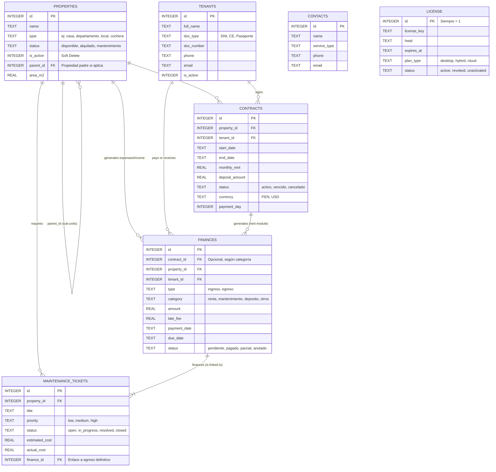

# Modelo de Datos (Data Model)

## 1. Diagrama Entidad Relación (Mermaid)

El modelo central del negocio y la facturación, simplificado:

## 2. Diccionario de Tablas Principales

### 2.1 Tabla `properties`
Almacena todos los inmuebles gestionados. Destaca el diseño de "Sub-unidades" a través de la llave de auto-referencia (`parent_id`), lo que permite que el administrador arriende un edificio matriz ("Edificio Los Olivos", parent), y dentro del mismo registre múltiples propiedades ("Departamento 101", "Cochera A") que heredan dependencias.

-   **`type`**: String genérico. Generalmente toma valores de la UI como 'casa', 'departamento', 'habitacion', 'local', 'cochera'.
-   **Columnas de Control Físico (booleanas)**: `has_elevator`, `has_stairs`, `has_parking`, etc (ENTEROS de corto valor `0/1` en SQLite predeterminado).
-   **`shared_amenities`**: Cadena de texto tipo JSON persistida `[]` para listar dinámicamente facilidades extra (piscina, zona BBQ) ahorrando crear un esquema relacional complejo e insostenible.

### 2.2 Tabla `tenants`
Clientes a los cuales se les confieren permisos de arrendamiento.
-   **`doc_number` / `doc_type`**: Garantizan identificación contable de cada inquilino.
-   **`is_active`**: Borrado lógico (Soft-delete). Vital para mantener el historial contable inalterado y prevenir romper contratos vencidos.

### 2.3 Tabla `contracts`
La tabla transaccional más importante antes de finanzas. Consolida a `properties` e `inmuebles`.
-   **`payment_day`**: Número del 1 al 31 que indica cuándo vence convencionalmente el período de pago (ej: Los días 05 de cada mes).
-   **Anotación**: Un contrato puede terminar en status `'vencido'` manteniéndose inactivo. El sistema requiere emitir alertas respecto a `end_date`.

### 2.4 Tabla `finances`
Registro universal de Asientos (Ledger) para caja. Todos los pagos, multas, compras y honorarios de reparaciones entran como flujos aquí.
-   **`type`**: `'ingreso'` o `'egreso'`.
-   **`category`**: Descriptivo lógico interno (ej: 'renta', 'servicio', 'arreglo').
-   **`receipt_paths`**: Text JSON array persistiendo múltiples links en el ordenador (tickets escaneados, o rutas en la web) para auditorías visuales futuras.
-   **`status`**: Define la efectividad del cobro en reportes (Ej: solo los pasados a 'pagado' computan a total ingresos/egresos).

### 2.5 Tablas del Sistema (`license` y `cloud_backups`)
Manejan el licenciamiento comercial del cliente HRA Estadística y el registro de la salud del sync asíncrono hacia base de datos Web. Supabase se nutre a nivel registros casi idénticamente de esta especificación.
-   **`license`**: Siempre consta de una única fila forzada (`id = 1`) para evitar malversación estructural. Controla variables temporales como `cloud_expires_at` para desactivar módulos prémium.

## 3. Consideraciones y Migraciones Futuras
El motor local `database.js` está dotado de un sistema de migración "Lazy" interno. Durante el momento de inicialización, en lugar de manejar versionados arcaicos, `better-sqlite3` intercepta `PRAGMA table_info()` y añade dinámicamente (`ALTER TABLE ADD COLUMN`) cualquier atributo reciente que la nueva actualización mande, sin destruir el archivo origen del usuario `easyrent.db`.
